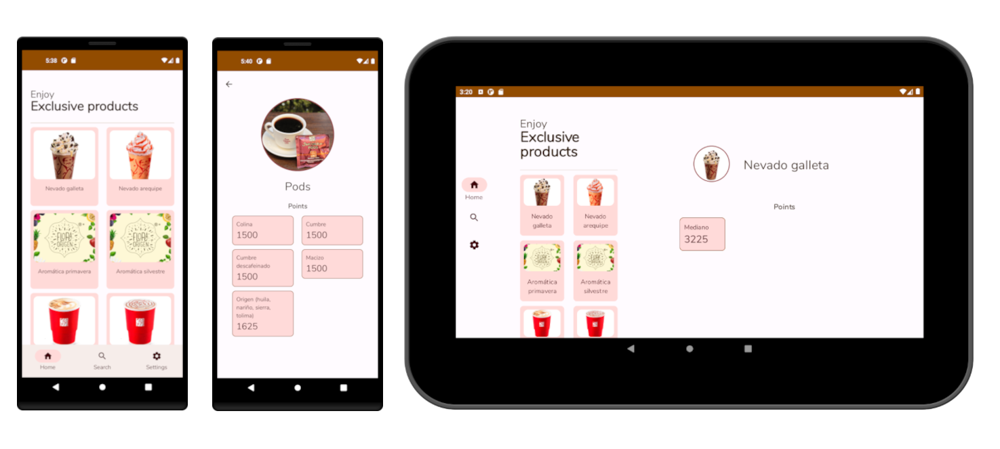
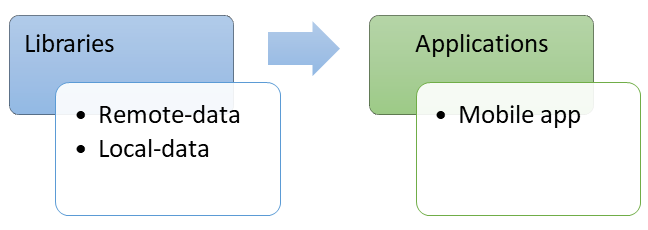

# AJV-CAPPA

Demo android application built with [Jetpack Compose](https://developer.android.com/jetpack/compose). The goal of the
demo application is to showcase points and product catalog listing for "Amigos Juan Valdez" program.

## Application features

The application consists of three sub-modules: First, for the local catalog data, second, remote catalog data, and
finally, the mobile app module, which contains both mobile (smartphone) and tablet ui interfaces.

Inside the `mobile-app` module, there are the following application features: catalog listing, catalog search and
settings.

| Feature  | Package                                        | Description                                                                                  |
|----------|------------------------------------------------|----------------------------------------------------------------------------------------------|
| Listing  | dev.marlonlom.demos.ajv_cappa.catalog.list     | This screen allow to view all catalog products and select one for view it's detail.          |
| Search   | dev.marlonlom.demos.ajv_cappa.catalog.search   | This screen allow to do search for catalog products and select one for view it's detail.     |
| Settings | dev.marlonlom.demos.ajv_cappa.catalog.settings | This screen allow to change the application settings, such as dark theme and dynamic colors. |

## Other Features

- Completely ad-free.
- Light/Dark theming.
- Dynamic color theming (enabled for android 12 or superior).
- Uses `MaterialTheme` composable and M3 components.
- Custom fonts: [Nunito](https://fonts.google.com/specimen/Nunito).
- Navigation components: Using `NavigationBar` for mobile phone portrait UI and `NavigationRail` for tablet and
  landscape UI.
- Coroutines.
- Local storage with Room.
- MVVM pattern (views (Composables), ViewModel, repository, data sources).
- WorkManager for background tasks.
- Needs no special permissions on Android 6.0+.

## Screenshots

The following are the location for screenshots of the mobile app, by form factor and screen orientation:

- Phone (portrait) [LICENSE](screenshots/phone-portrait)
- Phone (landscape) [LICENSE](screenshots/phone-landscape)
- Tablet (portrait) [LICENSE](screenshots/tablet-portrait)
- Tablet (landscape) [LICENSE](screenshots/tablet-landscape)

## License

This application is released under MIT (see [LICENSE](LICENSE)).
